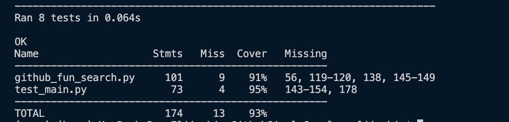
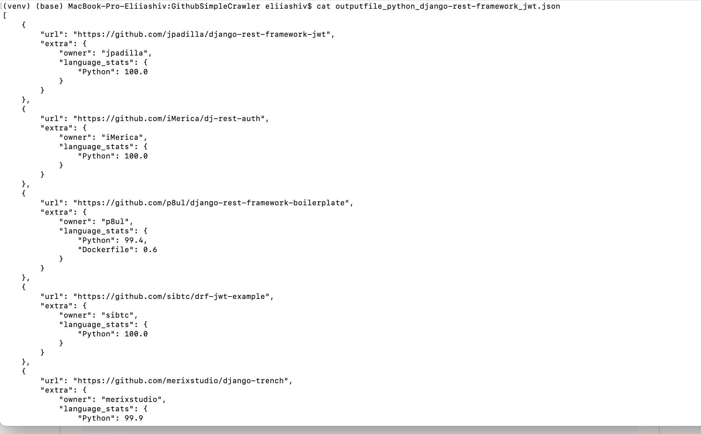

# GithubSimpleCrawler

## Project Description
This project is a GitHub crawler designed to search for repositories, issues, or wikis on GitHub using specific keywords. It is designed to be efficient in terms of speed, memory usage, and CPU usage.

## Requirements

- Python 3
- The crawler should be as efficient as possible (fast, low memory usage, low CPU usage)
- Input:
  - Search keywords: a list of keywords to be used as search terms (unicode characters must be supported)
  - List of proxies: one of them should be selected and used randomly to perform all the HTTP requests (you can get a free list of proxies to work with at [Free Proxy List](https://free-proxy-list.net/))
  - Type: the type of object we are searching for (Repositories, Issues, and Wikis should be supported)
- Output: URLs for each of the results of the search
- The code should include unit tests with a minimum code coverage of 90%
- Process only the first page of results
- Use raw HTML for processing, JSON API cannot be used
- You can use any library for the task (e.g., HTTP libraries, parser libraries), but not frameworks (e.g., Scrapy)

## How to Use

### Manual Setup using Virtualenv

1. **Clone the repository**:
```sh
git clone https://github.com/Madaocv/GithubSimpleCrawler.git
cd GithubSimpleCrawler
```

2. **Create and activate a virtual environment**:
```sh
virtualenv -p python3 venv
source venv/bin/activate
```

3. **Install the required packages**:
```sh
pip install -r requirements.txt
```

4. **Execute script**:
```sh
python github_fun_search.py --proxy=http://50.223.239.165:80 --filename=output_file
```

5. **Execute test**:
```sh
coverage run -m unittest discover && coverage report -m
```
6. **Output file with results**:
Based on keywords the results will be stored on file "outputfile_python_django-rest-framework_jwt.json"
### Running test with coverage report


*Coverage report*


*Results example*